# ☕ J-Architect: AI-Powered Java Auditor

**J-Architect** es una solución avanzada de auditoría y modernización de código diseñada específicamente para el ecosistema Java. La aplicación utiliza Inteligencia Artificial Generativa para actuar como un **Arquitecto de Software Senior**, detectando deuda técnica, aplicando refactorizaciones automáticas y generando configuraciones de despliegue optimizadas.
Además te da la posibilidad de interactuar a través de un chatbot con IA y retención, con el cual puedes absolver dudas e incluso seguir pidiéndole mejoras al código refactorizado.

## 🚀 Propósito del Proyecto
En el ciclo de vida de desarrollo de software (**SDLC**), la revisión de código y la modernización de sistemas legados son cuellos de botella críticos. **J-Architect** resuelve esto mediante:
*   **Análisis Experto:** Identificación instantánea de antipatrones (ej. inyección por campo, manejo pobre de excepciones).
*   **Refactorización Inteligente:** Generación de código limpio basado en estándares de industria.
*   **Guardrails Programáticos:** Validación de la propuesta de la IA mediante reglas estáticas.
*   **Acompañamiento Continuo:** Un chatbot con memoria de contexto para resolver dudas técnicas sobre el refactor.

## 🛠️ Tecnologías Utilizadas
*   **Frontend & UI:** [Streamlit](https://streamlit.io/) (Interfaz web reactiva para Python).
*   **Cerebro de IA:** [Google Gemini 2.5 Flash](https://ai.google.dev/) (Modelo de lenguaje con ventana de contexto extendida).
*   **Orquestación:** SDK de Google Generative AI para gestión de sesiones de chat y prompts de sistema.
*   **Procesamiento:** Python 3.10+ con soporte para expresiones regulares (Regex) para parsing de artefactos.
*   **Despliegue:** [Streamlit Cloud](https://streamlit.io/cloud).

## 📋 Funcionalidades Clave
1.  **Auditoría Multi-Framework:** Detección automática de contextos Java SE, Spring Boot y Quarkus.
2.  **Sistema de Pestañas Estructurado:**
    *   **Diagnóstico:** Resumen ejecutivo de deuda técnica.
    *   **Refactor:** Código corregido listo para producción con opción de descarga.
    *   **Validación:** Verificación automática de cumplimiento de reglas (Constructor injection, Exception handling, etc.).
    *   **DevOps:** Generación de Dockerfiles y estrategias de CI/CD.
3.  **Chat Contextual:** Un agente que recuerda el código analizado para iterar sobre nuevas mejoras.

## 💻 Instalación y Ejecución Local

Si deseas ejecutar este proyecto localmente, sigue estos pasos:

1. **Clonar el repositorio:**
   ```bash
   git clone https://github.com/zditherg/obsmod1-pyintegrador.git
   cd obsmod1-pyintegrador

2. **Crear y activar el entorno virtual**
    ```bash
    python -m venv venv
    source venv/bin/activate  # Windows: venv\Scripts\activate

3. **Instalar Dependencias**
    ```bash
    pip install -r requirements.txt

4. **Ejecutar la Aplicación**
    ```bash
    streamlit run proyectoFinal.py

5. **Configura tu GOOGLE_API_KEY**
Ingresa al siguiente link, sino tienes acceso debes de registrarte.
    ```bash
    https://aistudio.google.com/api-keys

## 🌐 Aplicación Desplegada

Puedes probar la aplicación en el siguiente link: https://obsmod1-pyintegrador-uuqjfcziiwxxdjqs29wnf2.streamlit.app/

## 📸 Capturas de Pantalla
1. ** Pantalla Principal **

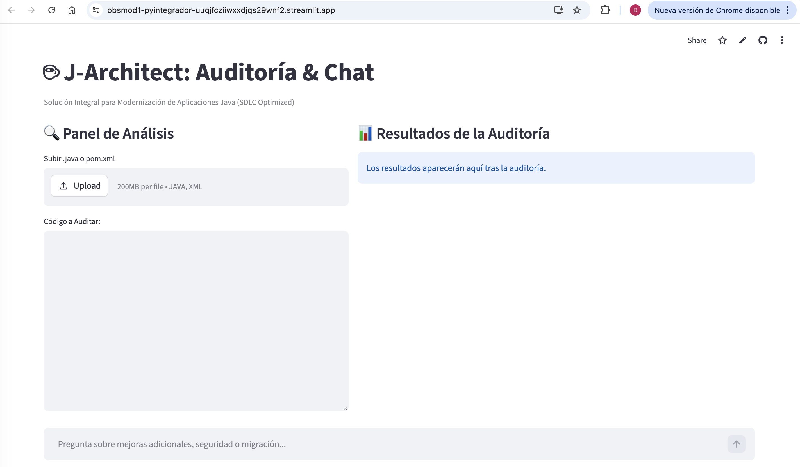

2. ** Seleccionar archivo .java **
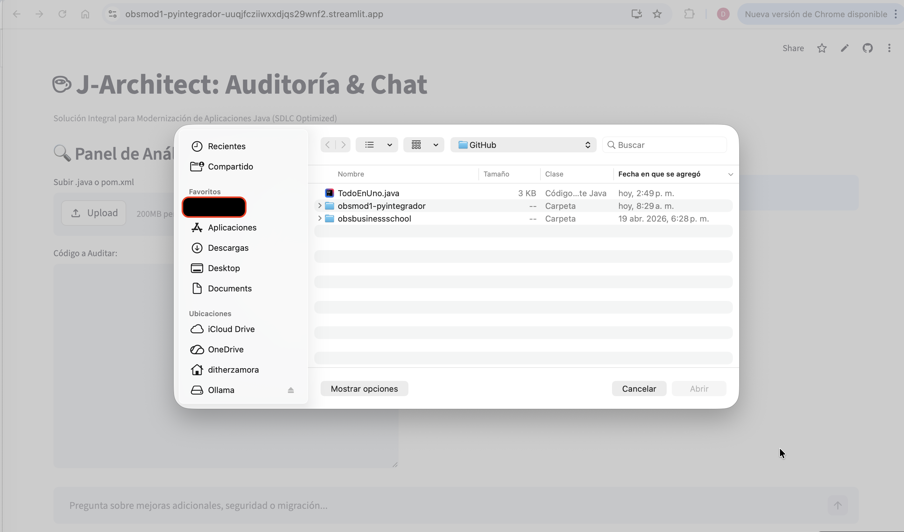

3. ** Lectura del archivo cargado **
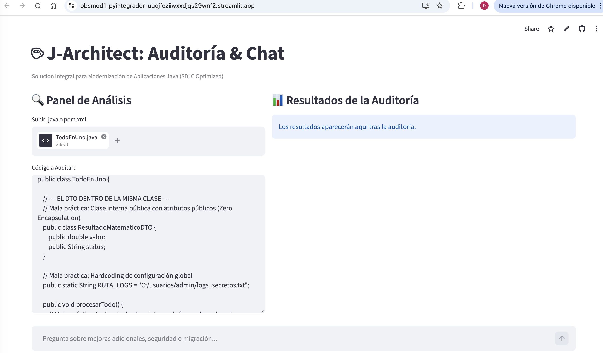

4. ** Resultado del Diagnóstico **
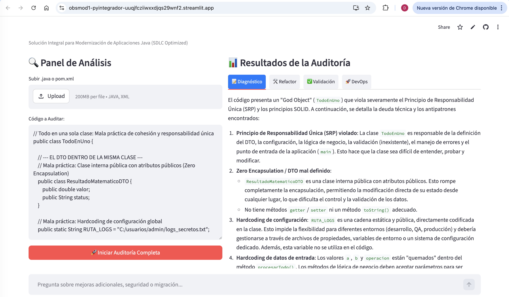

5. ** Aplicación de Refactorización **
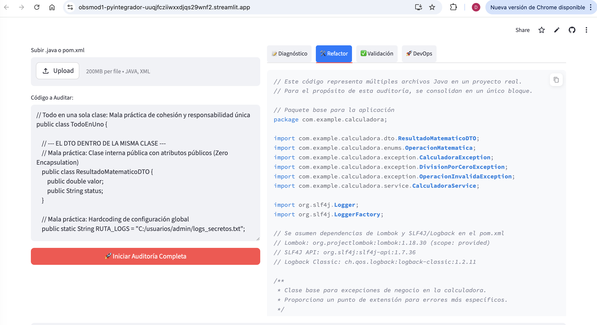

6. ** Aplicación de Refactorización - Parte 2 **
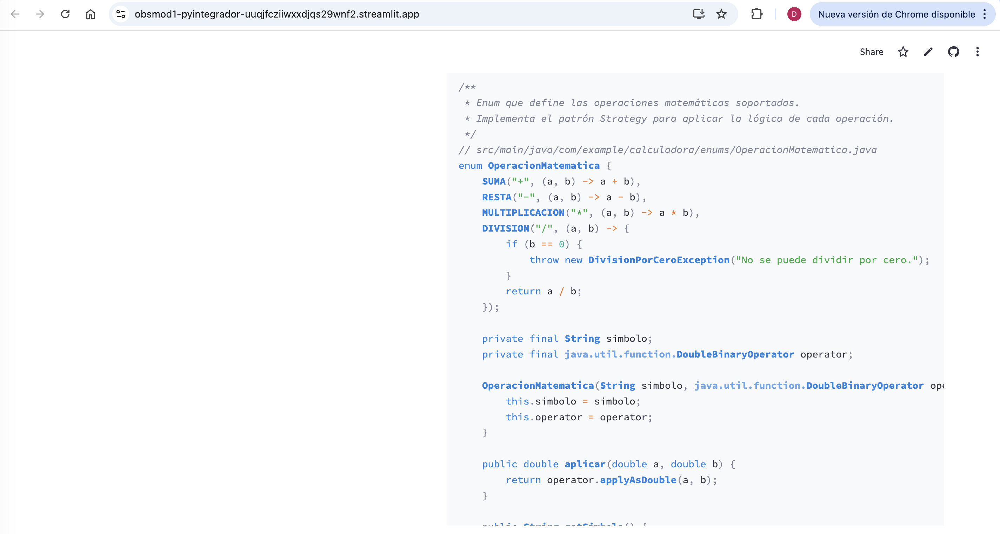

7. ** Validación de Código Refactorizado **
    ```bash
    Utiliza el mock para CheckStyle:
    def validate_java_rules(code):
    checks = {
        "Constructor Injection": (r"public\s+\w+\s*\([^)]*\w+\s+\w+\s*\)\s*\{", "Uso de inyección por constructor detectado (Buena práctica)."),
        "Custom Exception Handling": (r"catch\s*\(\s*(?!Exception|Throwable|Runtime)\w+\s+\w+\s*\)", "Manejo de excepciones específicas detectado."),
        "Quarkus/Lombok Optimization": (r"@Inject|@Data|@Builder|@ApplicationScoped", "Uso de anotaciones de productividad y scopes correctos."),
        "Avoid Field Injection": (r"@Autowired\s+private", "CRÍTICO: Se detectó inyección por campo (Mala práctica).", True), # True si es negativo
        "Hardcoded Secret Check": (r"[\"'][a-zA-Z0-9+/]{20,}[\"']", "ADVERTENCIA: Posible secreto o token hardcodeado.", True)
    }
    results = []
    for name, data in checks.items():
        pattern, msg, *is_neg = data
        match = re.search(pattern, code)
        if is_neg and is_neg[0]:
            results.append(f"❌ **{name}**: {msg}" if match else f"✅ **{name}**: No detectado.")
        else:
            results.append(f"✅ **{name}**: {msg}" if match else f"⚠️ **{name}**: No verificado.")
    return results

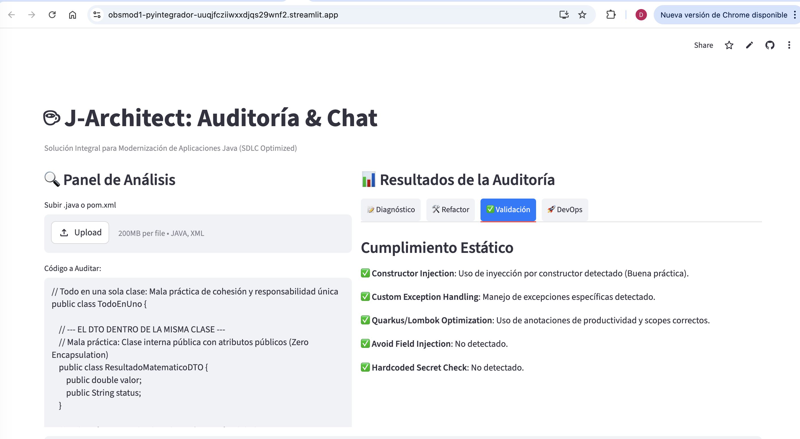

8. ** Construcción del Docker File para Prueba **
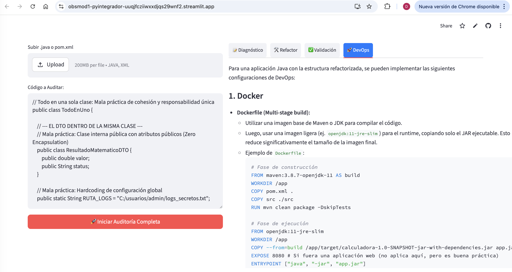

9. ** Chat Interactivo con Retención **
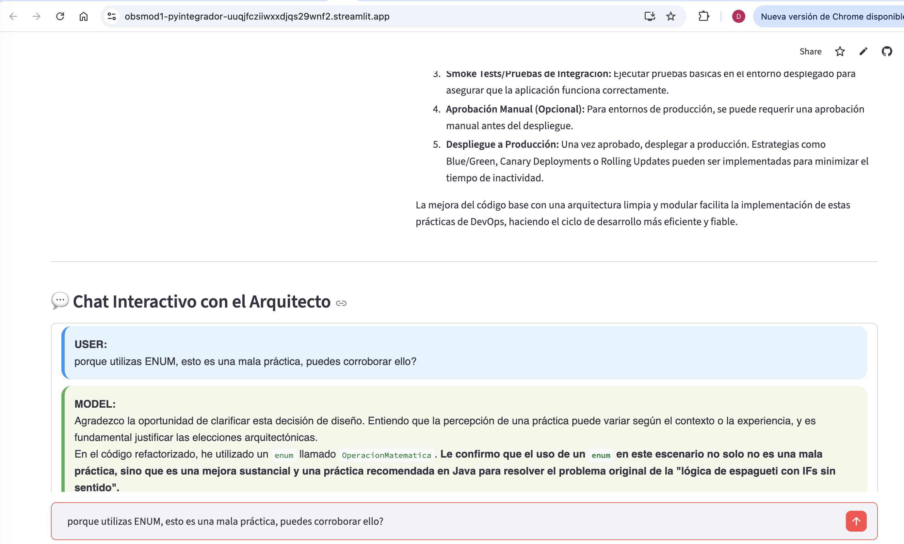

10. ** Chat Interactivo con Retención **
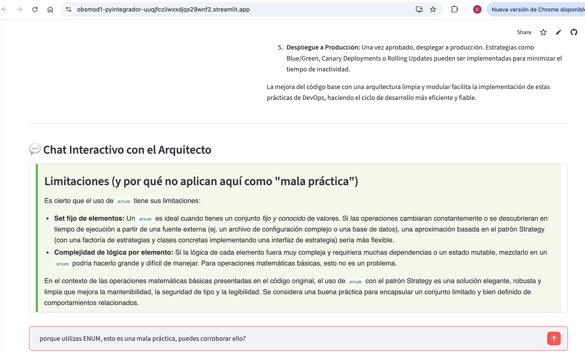

11. ** Chat Interactivo: Se solicita agregar una nueva operación **
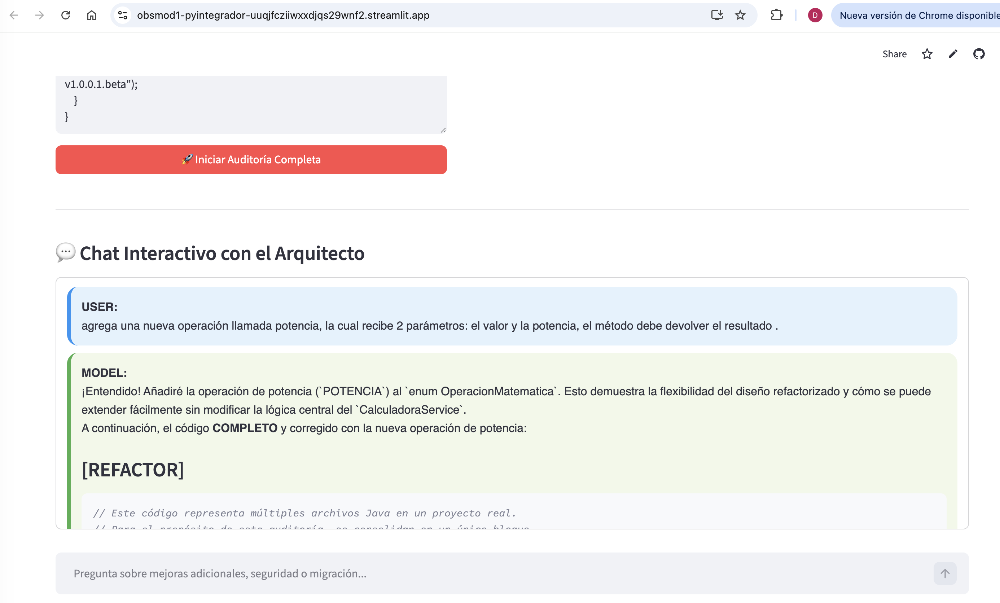
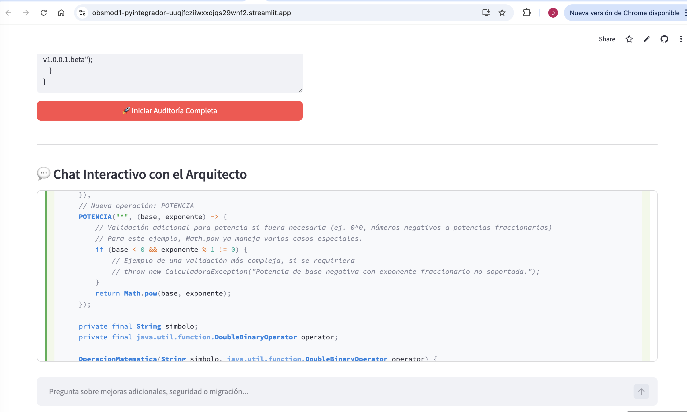